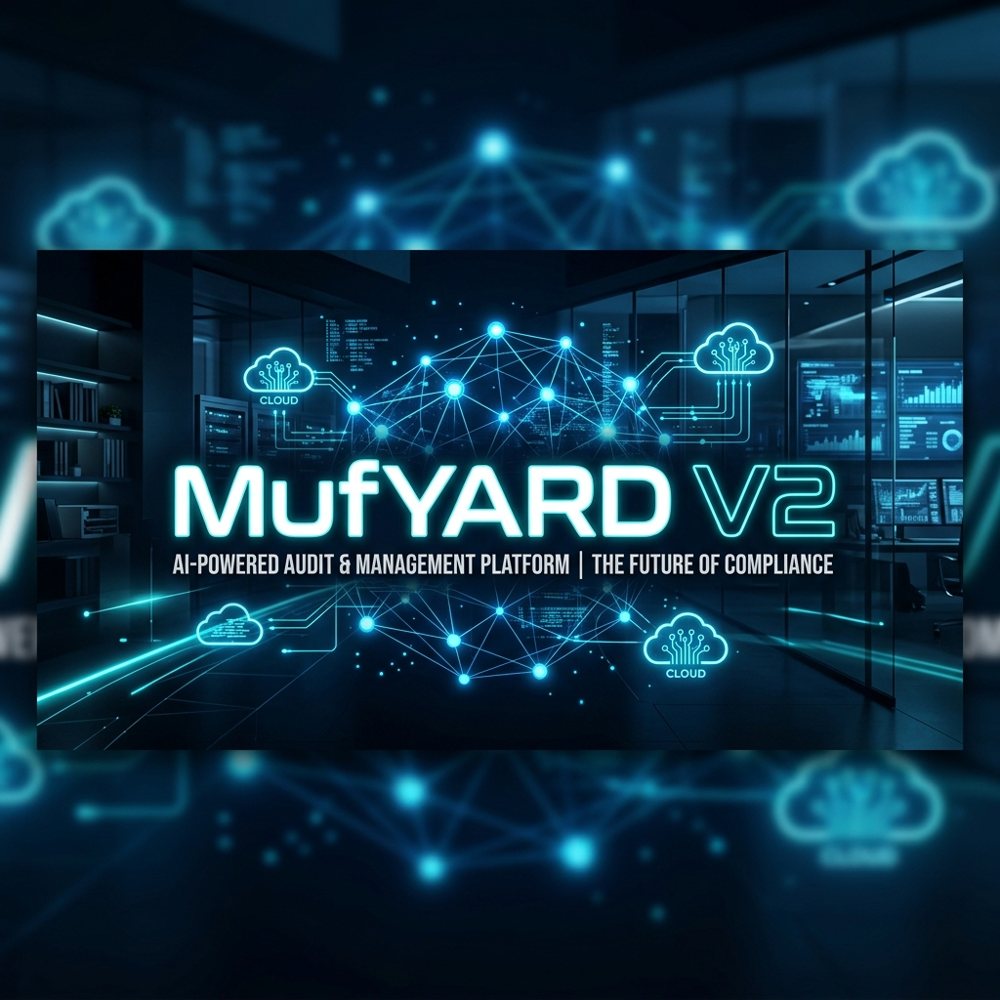

# 🚀 MufYARD V2 - Dijital Denetim Asistanı

> **Geleneksel denetim tecrübesini, Yapay Zeka ve Hibrit Bulut teknolojileriyle geleceğe taşıyan yeni nesil dijital asistanınız.**

MufYARD V2, denetim süreçlerini optimize etmek, veri analizini kolaylaştırmak ve müfettişlerin günlük iş yükünü akıllı çözümlerle hafifletmek için tasarlanmış kapsamlı bir masaüstü uygulamasıdır.

---

## ✨ Temel Özellikler

- 🤖 **Yapay Zeka Desteği:** Mevzuat analizi, rapor taslağı oluşturma ve akıllı sorgulama.
- ☁️ **Hibrit Bulut Senkronizasyonu:** Verileriniz hem yerelde hem de güvenli bulut altyapısında anlık senkronize olur.
- 📋 **Görev ve Not Yönetimi:** Denetim süreçlerine özel özelleştirilmiş görev takibi.
- 📞 **Kurumsal Rehber & İletişim:** Entegre mesajlaşma ve güncel kurumsal rehber erişimi.
- 📚 **Mevzuat Kütüphanesi:** Çevrimdışı ve çevrimiçi erişilebilen güncel mevzuat arşivi.
- 📊 **Veri Analiz Araçları:** Excel entegrasyonu ve otomatik raporlama bileşenleri.

---

## 📦 Kurulum ve Çalıştırma

Uygulamayı kullanmaya başlamak için en son kararlı sürümü indirin:

1.  **[Releases](../../releases/latest)** sayfasına gidin.
2.  `MufYARD-Setup-x.x.x.exe` dosyasını indirin.
3.  Kurulumu tamamlayın ve masaüstündeki **MufYARD** kısa yoluna tıklayın.

---

## 🛠️ Teknolojiler

- **Frontend:** React, TypeScript, Vite, Tailwind CSS
- **Masaüstü Katmanı:** Electron
- **Backend:** Python (FastAPI), PyInstaller
- **Veritabanı & Cloud:** Firebase (Firestore, Auth, Storage), Railway
- **Yapay Zeka:** Google Gemini API

---

## 👨‍💻 Geliştirici

Bu proje **GSB** bünyesinde denetim süreçlerini dijitalleştirmek amacıyla geliştirilmiştir.

---

## 📄 Lisans

Bu proje özel mülkiyet kapsamındadır ve yalnızca yetkili personel kullanımı için tasarlanmıştır.

---
*MufYARD V2 - Denetimde Geleceğin Standartlarını Belirleyin.*
